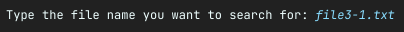
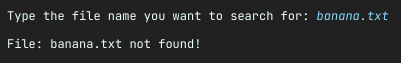

# File Searcher

In this exercise, we are going to implement a file search application using the `FileVisitor`
interface. We want to make it possible for the user to specify the complete file name with extension
and a starting directory in which to look.

When we find the file, we print a success message to the screen and when the entire file tree is
searched without the file being found, we also print an appropriate failure message.

##

## Step 1: The `FileVisitor`

Create a class that implements the `FileVisitor` interface. The generic type you should provide to
the interface is `Path`.

The implementation should contain two fields:

```java
private final String fileName;

private final Path startDir;
```

- `fileName`: the name of the file we'll be looking for;
- `startDir`: The starting directory to search for the file.

Make sure to create a `constructor` for the class that receives both parameters.

We will only use the starting path as a base case to conclude that the file has not been found.

##

## Step 2: The `preVisitDirectory` API

Start by implementing the `preVisitDirectory` API method.

This API is called each time the process encounters a new directory in the tree. Its return value
determines what will happen next depending on what we decide. This is the point at which we would
skip specific directories and eliminate them from the search sample space.

In our scenario, we should not to discriminate any directories and just search in all of them, so
make sure to return the right `FileVisitResult` value.

##

## Step 3: The `visitFile` API

Next, we will implement the `visitFile` API. This is where the main action happens. This API is
called everytime a file is encountered. We take advantage of this to check the file attributes and
compare with our criteria and return an appropriate result.

Check the name of the file being visited. You can achieve that with:

```java
String currentFileName=file.getFileName().toString();
```

It gets the file name from the `Path`, and then converts it to a `String`.

Now, compare the `currentFileName` with the `fileName` we receive when initializing
our `FileVisitor`.

If the name is the same, we found the file we were looking for. Print a message to the console
saying the file was found and the path to it. Since the file was found, the tree traversal should
terminate, so make sure to return the right `FileVisitResult` value.

If it's not the same, then the current visited file is not the one we're looking for, so we just
continue.

##

## Step 4: The `visitFileFailed` API

Next, we will implement the `visitFileFailed` API. This API is called when a specific file is not
accessible to the JVM. Perhaps it has been locked by another application, or it could just be a
permission issue.

Regardless, we simply log a failure message and continue with traversal of the rest of the directory
tree.

##                         

## Step 5: The `postVisitDirectory` API

Finally, we will implement the `postVisitDirectory` API. This API is called each time a directory
has been fully traversed.

We should check if the directory that has just been traversed is the directory where we started
traversal from. If the return value is `true`, that means the search is complete and the file has
not been found. So we terminate the process with a failure message.

However, if the return value is `false`, that means we just finished traversing a subdirectory and
there is still a probability of finding the file in some other subdirectory. So we continue with
traversal.

You should use the `Files.isSameFile()` method to compare the file names - the `Path` received as a
parameter from the `postVisitDirectory` against the `Path` we received in the constructor -
the `startDir` field.

##

## Step 6: The Main class

Now that our `FileVisitor` is implemented, head to the `FileSearcher` class. This class contains
our `main` method, as well as a constant pointing to our root folder - the `data` folder.

Here, you should use the `System.in` to get the input from the keyboard. Since it is
an `InputStream`, you could convert it to a `Reader` using the `InputStreamReader`, and finally,
wrap it with the `BufferedReader` for faster I/O. Also, the `BufferedReader` contains the
method `readLine()`, which can be used to read the user input.

Print a message to the console asking for the file name to search for, and capture the user input:



Get a `Path` instance for our root folder. Create an instance of the `FileVisitor` you just created,
and provide both the user's input and the `Path` to the root folder as parameters to the
constructor.

This will indicate we want to search for the file with the name the user just inputted, and the base
folder to look for is the `data` folder.

Finally, walk the tree with using the `Files.walkFileTree()`, providing both the `FileVisitor` you
created and the `Path` to the root folder.

If the file was found, you should get an output similar to:


On the other hand, if the file is not found, you should expect:



##

## Testing

Check the `data` folder. Each sub folder has a set of sub folders, and in the end each folder has a
file in it.

Valid file name results for this test are:

- data.txt
- file1.txt
- file1-1.txt
- file1-2.txt
- file2.txt
- file2-1.txt
- file2-2.txt
- file3.txt
- file3-1.txt
- file3-2.txt
- file3-3.txt